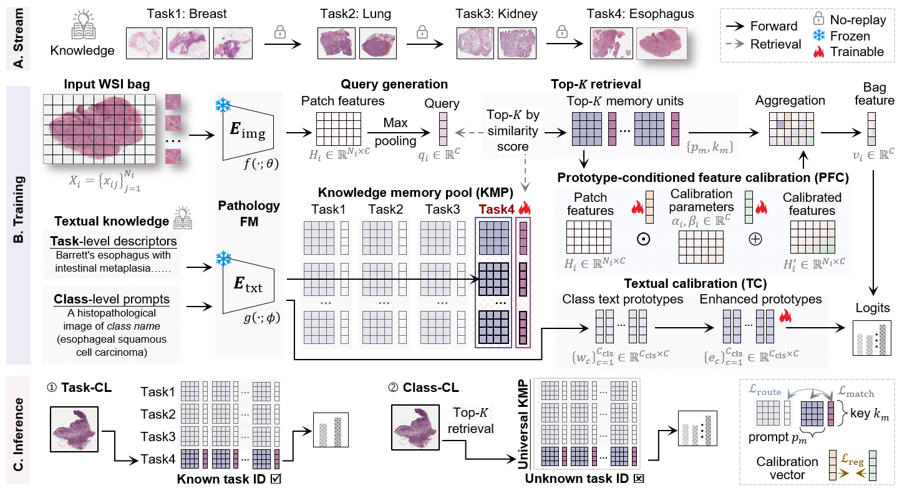

# [MICCAI 2026] KMP-MIL: Knowledge memory pool multiple instance learning with foundation model for continual whole slide image classification

**Authors:** Lingling Yuan, Zhaoxia Yin, Yan Han, Jinghua Zhang, Marcin Grzegorzek, Chen Li*

## Abstract

Continual learning for pathological whole slide image (WSI) classification is challenging because gigapixel slides, sparse diagnostic cues, and cross-organ domain shifts can intensify catastrophic forgetting. Knowledge Memory Pool Multiple Instance Learning (KMP-MIL) is a rehearsal-free continual multiple instance learning (MIL) framework that combines a frozen pathology foundation model with compact memory-based adaptation. Instead of storing historical WSIs or patch features for replay, it grows a Knowledge Memory Pool (KMP) and retrieves task-relevant memory units for feature calibration, MIL aggregation, and semantic classification in a shared vision-language space.


1. **Growing knowledge memory pool:** KMP-MIL uses a growing KMP to store compact task-specific memory units, avoiding the replay of historical WSIs.
2. **Query-based Top-K memory retrieval:** KMP-MIL designs a query-based mechanism for WSI-specific Top-K memory selection, and combines it with Prototype-conditioned Feature Calibration (PFC) and Textual Calibration (TC) in a shared vision-language space to improve adaptation and cross-organ semantic alignment.
3. **Sequential cross-organ evaluation:** KMP-MIL is evaluated on sequential WSI classification across breast, lung, kidney, and esophagus datasets under both task-incremental continual learning (task-CL) and class-incremental continual learning (class-CL) settings, including reverse-order evaluation. It achieves strong performance with reduced forgetting and good storage efficiency.





This implementation uses CONCH as the frozen pathology foundation model. Please download the CONCH pretrained checkpoint separately and set `conch_ckpt_path` in `main.yaml`. Place the CONCH code as a top-level package, at the same level as `models/`.

## Data Preparation

KMP-MIL expects slide-level bags represented by pre-extracted CONCH patch features. The preprocessing pipeline contains two stages: patch extraction with CLAM and feature extraction with CONCH.

### 1. Patch WSI Slides with CLAM

We use the fast patching pipeline from CLAM:

- CLAM repository: [https://github.com/mahmoodlab/CLAM](https://github.com/mahmoodlab/CLAM)
- CLAM patching script: `create_patches_fp.py`

One-line command:

```bash
python create_patches_fp.py --source <SOURCE_WSI_DIR> --save_dir <PATCH_OUTPUT_DIR> --patch_size 256 --patch_level 1 --seg --patch --stitch
```

This step generates patch coordinate files and a `process_list_autogen.csv` file for the processed slides.

### 2. Extract CONCH Features

We use CONCH to extract patch-level features:

- CONCH repository: [https://github.com/mahmoodlab/CONCH](https://github.com/mahmoodlab/CONCH)
- CONCH pretrained model: [https://huggingface.co/MahmoodLab/CONCH](https://huggingface.co/MahmoodLab/CONCH)

Please request access to the pretrained CONCH checkpoint on Hugging Face and follow its license and usage terms. 

One-line command:

```bash
python extract_features_fp.py --data_h5_dir <PATCH_H5_DIR> --data_slide_dir <SOURCE_WSI_DIR> --csv_path <PROCESS_LIST_CSV> --feat_dir <FEATURE_OUTPUT_DIR> --batch_size 512 --slide_ext .svs --model_name conch_v1
```

### 3. Organize Dataset Files

Each dataset directory should follow the same structure as the prepared `bracs` dataset:

```text
DATA_ROOT/
├── bracs/
│   ├── datasplit/
│   │   ├── fold_1.npz
│   │   ├── ...
│   │   └── fold_10.npz
│   ├── feats-l1-s256_CONCH/
│   │   └── pt_files/
│   │       └── <slide_id>.pt
│   └── table/
│       └── BRACS_path_subtype_x10_processed.csv
├── tcga_lung/
├── tcga_rcc/
└── tcga_esca/
```

Folder contents:

- `datasplit/`: patient-level cross-validation splits, including train, validation, and test patients for each fold.
- `feats-l1-s256_CONCH/pt_files/`: pre-extracted CONCH feature tensors, with one `.pt` file per slide.
- `table/`: slide metadata CSV files used by the dataloader. Each CSV should contain at least `patient_id`, `pathology_id`, and `label`.


## Running Experiments

Create and activate the environment:

```bash
conda create -n kmpmil python=3.9 -y
conda activate kmpmil
conda install pytorch==1.11.0 torchvision==0.12.0 cudatoolkit=11.3 -c pytorch
pip install -r requirements.txt
```

Run KMP-MIL with the default continual WSI classification setting:

```bash
python main.py -f main.yaml -s 1
```

By default, `main.yaml` enables 10-fold cross-validation. Training logs, checkpoints, and evaluation files will be saved under `results/`.
